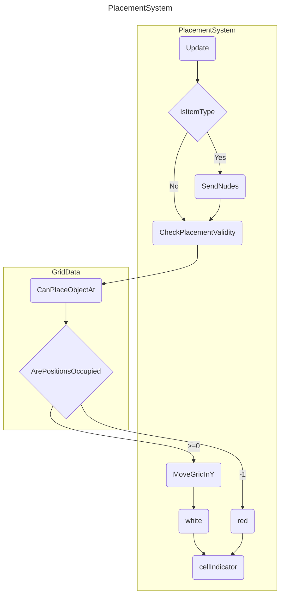

```mermaid
---
title: PlacementSystem
---
flowchart TD
    subgraph  PlacementSystem
        id0(Update)-->id1{IsItemType}
        id1 -- Yes --> id2(SendNudes)
        id1 -- No --> id3(CheckPlacementValidity)
        id5
        id9 --> id7(cellIndicator)
        id6 --> id7
    end
    subgraph GridData
        id2 --> id3
        id3 --> id4(CanPlaceObjectAt)
        id4 --> id8{ArePositionsOccupied}
        id8 -- >=0 --> id5(MoveGridInY)
        id8 -- -1 --> id6(red)
        id5 --> id9(white)
    end
    
    
```